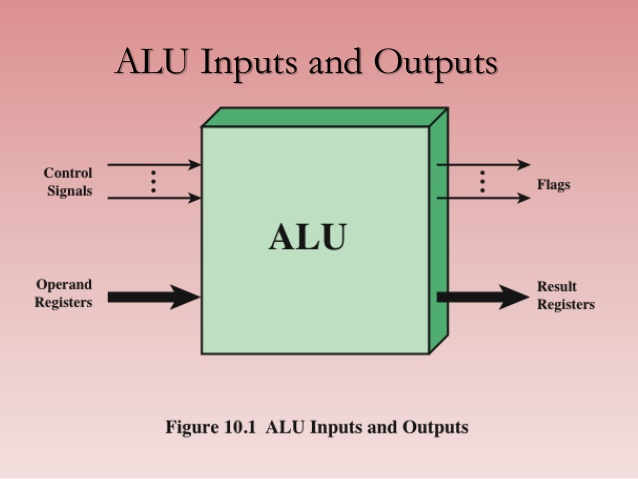

# Projekt ALU
## Teoretický úvod
ALU neboli aritmetická a logická jednotka "Arithmetic & Logic Unit". Bez jeho implementace se v dnešní době neobejde žádný mikroprocesor. Je to fundament moderních počítačů, takový matematický mozek. Vnitřní stavba je ze dvou "subbloků", jeden se stará o aritmetické operace a druhá se stará o operace logické.

Aritmetické operace jsou např.: sčítání, odčítání, +1 = increment, -1 = decrement, převod kladného na záporné, 'pass through', některé provedou i násobení a dělení, apod. 

Logické operace jsou např.: NOT, AND, OR, XOR, clear operation, apod.

## Obrázky

Tady můžeme vidět schématickou značku. Nahoře se nachází dva vstupy označené Operand 1 & 2. Jedná se o N bitové vstupy dvou čísel. Dále je na spodu jeden N bitový výstup. Po stranách je vstup OPCODE. Tento vstup je kritický, protože díky jeho hodnotě se volí jaká operace se provede s operandy na vstupech. V některých implementacích má M+1 bitů, kdy "+1" je MSB a rozhoduje, zda zbylé M bity svou hodnotou budou odpovídat "knihovně" s aritmetickými operacemi nebo logickými např. '0100' odpovída aritmetické operaci pro sčítání obou operand & '1100' odpovídá logické operaci XOR. To jakou operaci to provede záleží čistě na nastavení čipu popřípadě programu.
Také vidíme jeden status výstup. Ten v různýc případech plní různé funkce. Může se v něm nacházet výstup carry_out, popřípadě signalizace na led při záporném výsledku, overflow flag nebo nulový výstup.

Tady je vidět jiná obrazová intepretace, ale ve výsledku je to to samé. Vidíme vstup, výstup flagy neboli status výstup a control signal.

Příklad ALU 74181, blokové schéma je uvedeno na obrázku, vykonává se dvěma čtyřbitovými operandy A a B 16 aritmetických operací a 16 logických operací ve dvojkové soustavě. Obvod provádí např. aritmetické operace: sčítání, odčítání, přičtení jedničky, dvojkový doplněk, posuv o 1 místo vlevo, porovnání obou čísel a další. Dále obvod vykonává logické operace: logický součet, logický součin, dále funkce NAND, NOR, NOT, ekvivalenci a nonekvivalencí a další. Výběr operací je prováděn pomocí řídicích vstupů S0 až S3. Bit M určuje typ prováděné operace. Pro M = 1 provádí obvod logické operace a pro M = 0 provádí aritmetické operace. Kromě toho je druh operace závislý na hodnotě přenosu z nižšího řádu Cn. Je-li třeba zpracovávat data s více než 4 bity, mohou se obvody ALU 74181 řadit do série. Aby se přitom nezpomaloval výpočet v důsledku zpoždění šíření přenosu aritmetickými jednotkami, používá se speciální integrovaný obvod pro zrychlení šíření přenosu s označením 74182. Zapojení čtyř ALU jednotek pro délku operandů 16 bitů se zapojením obvodu pro zrychlení přenosu je znázorněno na dalším obrázku. Označení CLA značí "Carry Look-Ahead".

### Teoreetická příprava
Důležitou součástí vypracování projektu je teoretické usmyslení "co to vlastně udělam, jak to udělám...atd.". 
Proto by jsem si první měl odpovědět na několik otázek:

* Kolik bitů budou mít operandy A & B?
* Kolik bitů bude mít výstup?
* Kolik bitů bude mít kontrolní signál?
* Jaké dodatečné výstupy budu chtít?

