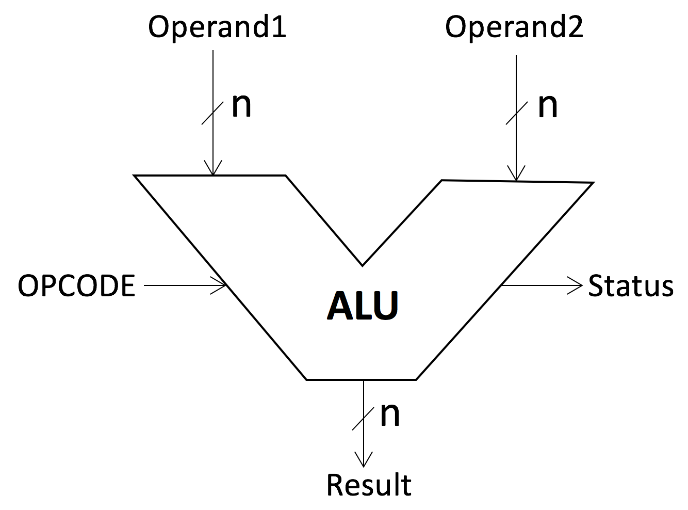

# Projekt ALU
## Teoretický úvod
ALU neboli aritmetická a logická jednotka "Arithmetic & Logic Unit". Bez jeho implementace se v dnešní době neobejde žádný mikroprocesor. Je to fundament moderních počítačů, takový matematický mozek. Vnitřní stavba je ze dvou "subbloků", jeden se stará o aritmetické operace a druhá se stará o operace logické.

Aritmetické operace jsou např.: sčítání, odčítání, +1 = increment, -1 = decrement, převod kladného na záporné, 'pass through', některé provedou i násobení a dělení, apod. 

Logické operace jsou např.: NOT, AND, OR, XOR, clear operation, apod.

## Obrázky

Tady můžeme vidět schématickou značku. Nahoře se nachází dva vstupy označené Operand 1 & 2. Jedná se o N bitové vstupy dvou čísel. Dále je na spodu jeden N bitový výstup. Po stranách je vstup OPCODE. Tento vstup je kritický, protože díky jeho hodnotě se volí jaká operace se provede s operandy na vstupech. V některých implementacích má M+1 bitů, kdy "+1" je MSB a rozhoduje, zda zbylé M bity svou hodnotou budou odpovídat "knihovně" s aritmetickými operacemi nebo logickými např. '0100' odpovída aritmetické operaci pro sčítání obou operand & '1100' odpovídá logické operaci XOR. To jakou operaci to provede záleží čistě na nastavení čipu popřípadě programu.
Také vidíme jeden status výstup. Ten v různýc případech plní různé funkce. Může se v něm nacházet výstup carry_out, popřípadě signalizace na led při záporném výsledku, overflow flag nebo nulový výstup.

Tady je vidět jiná obrazová intepretace, ale ve výsledku je to to samé. Vidíme vstup, výstup flagy neboli status výstup a control signal.

Příklad ALU 74181, blokové schéma je uvedeno na obrázku, vykonává se dvěma čtyřbitovými operandy A a B 16 aritmetických operací a 16 logických operací ve dvojkové soustavě. Obvod provádí např. aritmetické operace: sčítání, odčítání, přičtení jedničky, dvojkový doplněk, posuv o 1 místo vlevo, porovnání obou čísel a další. Dále obvod vykonává logické operace: logický součet, logický součin, dále funkce NAND, NOR, NOT, ekvivalenci a nonekvivalencí a další. Výběr operací je prováděn pomocí řídicích vstupů S0 až S3. Bit M určuje typ prováděné operace. Pro M = 1 provádí obvod logické operace a pro M = 0 provádí aritmetické operace. Kromě toho je druh operace závislý na hodnotě přenosu z nižšího řádu Cn. Je-li třeba zpracovávat data s více než 4 bity, mohou se obvody ALU 74181 řadit do série. Aby se přitom nezpomaloval výpočet v důsledku zpoždění šíření přenosu aritmetickými jednotkami, používá se speciální integrovaný obvod pro zrychlení šíření přenosu s označením 74182. Zapojení čtyř ALU jednotek pro délku operandů 16 bitů se zapojením obvodu pro zrychlení přenosu je znázorněno na dalším obrázku. Označení CLA značí "Carry Look-Ahead".

### Teoretická příprava
Důležitou součástí vypracování projektu je teoretické usmyslení "co to vlastně udělam, jak to udělám...atd.". 
Proto by jsem si první měl odpovědět na několik otázek:

* Kolik bitů budou mít operandy A & B?
    -tady záleží čistě na potřebách, modernější implementace se mohou pohybovat na 32 bitech, jiné na 16 nebo osmi. Pro naše účely, kdy na CPLD boardu se nachází 8+8 switchů, použiji pro vstup 4 & 4 bity.
* Kolik bitů bude mít výstup?
    -nejčastěji se odvíjí od velikosti vstupních bitů. Teoreticky by šel navýšit klidně i o +1 za předpokladu že chceme mít carry out součástí čísla výstupu.
* Kolik bitů bude mít kontrolní signál?
    -odvíjí se od toho, kolik operací chceme provádět pro 2 bity máme možnost aplikovat 4 různé operace, pro 3 bity 8, pro 4 bity 16 operací. Já jsem se rozhodnul pro 4 bitový kontrolní vstup, jelikož 32 operací se mi zdá už hodně a nejspíše bych všechny možnosti nezaplnil. 
* Jaké dodatečné výstupy budu chtít?
    -mohu zobrazit hodnotu například na led na CPLD boardě. Carry out flag, zero flag, overflow flag nebo negative flag se dají aplikovat. Já se rozhodnul pro aplikování zero flag, carry out flag a negative flag.

### Operations

| Kód | Operace |     
|:---:|:-------:|
| 0000 |  A + B  |
| 0001 |  A - B  |
| 0010 |  B - A  |
| 0011 |  A + 1  |
| 0100 |  A - 1  |
| 0101 |  B + 1  |
| 0110 |  B - 1  |
| 0111 | A = B ? |

|  Kód |       Operace      |
|:----:|:------------------:|
| 1000 |        NOT A       |
| 1001 |        NOT B       |
| 1010 |       A AND B      |
| 1011 |       A OR B       |
| 1100 |       A XOR B      |
| 1101 |      A XNOR B      |
| 1110 | Dvojkový doplněk A |
| 1111 | Dvojkový doplněk B |

### Vstupy

|Název|Účel|Velikost|
|-|-|-|
|__A__, __B__|operandy|4-bit|
|__alu_select__|operace|4-bit|
|__clk_i__|clock|1 bit|
|__srst_n_i__|reset button|1 bit|
|__en_i__|enable|1 bit|

### Outputs

|Název|Účel|Velikost|
|-|-|-|
|__carry_out__|Carry-Flag|1 bit|
|__negf__|Sign-Flag|1 bit|
|__zero__|Zero-Flag|1 bit|
|__y__|výsledek|4-bit|

## Kód
Kód jsem prvě dostal do funkčního stavu bez vstupního clocku. S testbenchem, který jsem provedl jsem byl spokojený. Jak můžeme vidět na obrázku, vše vypadá v pořádku, zobrazuje se dobře. 

/obrázek test_AluWithoutClock

Proto jsem přešel na další upgrade. Zaimplementoval jsem tedy celý proces aby záležel na clocku. To se mi také povedlo.

/příklady více clock ALU testbenchu

Všechny operace jsem vyzkoušel pro více různých případů vstupních hodnot. Jakožto vstupní čísla jsem použil dvě různé, které jsou menší při součtu než 15 tj. "plný" výstup nenastane, dále také dvě které jsou při součtu větší než "1111" a proto donutím carry out zapnout, v neposlední řadě jsem použil pro test dvě stejné čísla. Vše je vidět na obrázcích. 

Jak je viditelné z testbenche, oba se shodují a proto při implementaci clocku nedošlo k rozdílnostem ve funkčnosti. 

Tato jednotka se poskládala z jednotlivých sub segmentů, které každé plní svou funkci. Tak jak by se dala ALU poskládat z jednotlivých entit, kdy každá by plnila svou funkci. Tak je to vyřešené i v hardwaru. V procesoru se muže objevit například sekce tranzistorů, která plní jen funkci FULL ADDERU nebo jednoduché OR/AND. 

